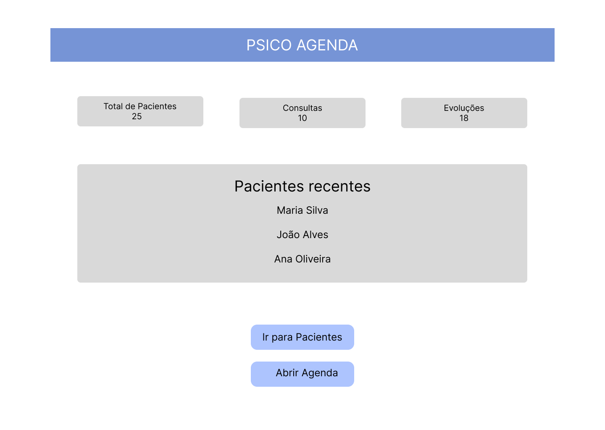
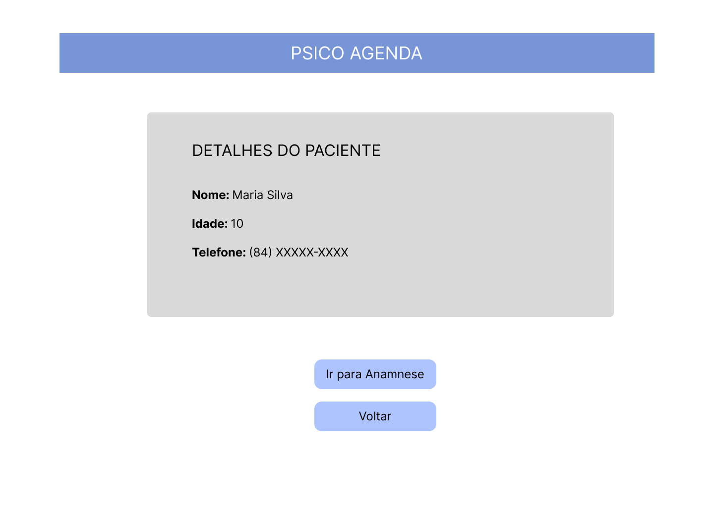
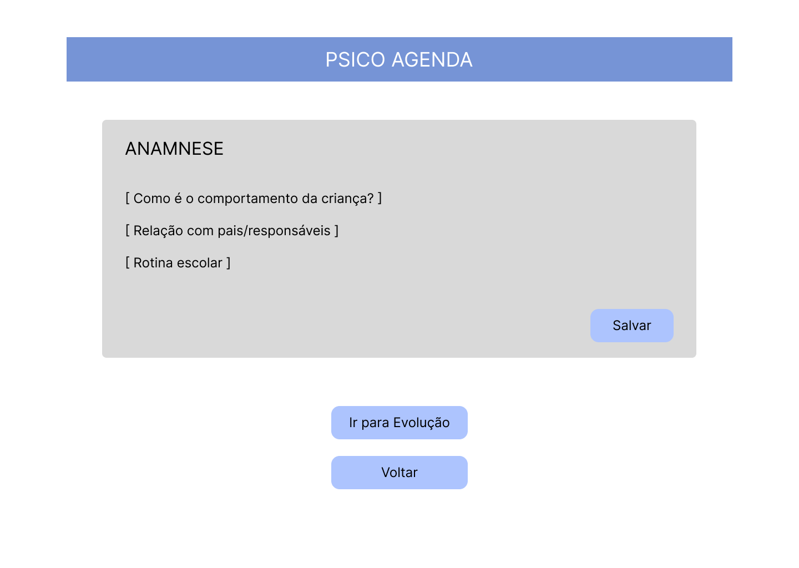
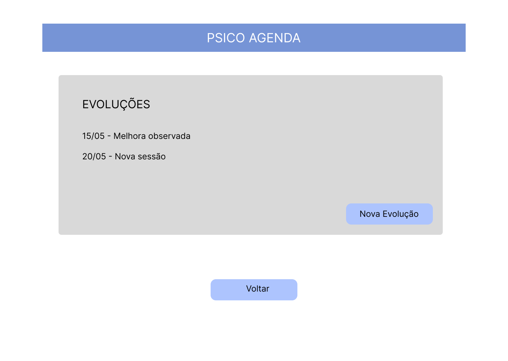

# PROJETO FINAL – DESENVOLVIMENTO WEB FRONTEND

## 1. Identificação

**Aluno:** Jucinara da Silva Melo  
**Matrícula:** 20240001180  
**Disciplina:** ECT3699 – Desenvolvimento Web FrontEnd  
**Professor:** Dr. Aquiles Burlamaqui  
**Período:** 2026.1

---

# Psico Agenda

**Organização clínica e acompanhamento psicológico em um único lugar**

---

## 2. Descrição Geral

O Psico Agenda é uma aplicação web desenvolvida para auxiliar psicólogos no gerenciamento de informações relacionadas ao acompanhamento de pacientes. O sistema tem como objetivo centralizar dados clínicos e facilitar o registro das atividades realizadas durante os atendimentos.

A aplicação permitirá o cadastro de pacientes, visualização de informações individuais, registro de anamneses, acompanhamento de evoluções e organização de consultas. Cada funcionalidade ficará separada em páginas específicas, proporcionando uma navegação mais simples e organizada.

Muitos profissionais utilizam anotações manuais, documentos separados ou ferramentas genéricas para registrar informações clínicas, o que pode dificultar a organização e o acompanhamento do histórico do paciente. O projeto busca reduzir essa dificuldade oferecendo uma interface única para gerenciamento dessas informações.

O desenvolvimento será realizado utilizando React para construção da interface e LocalStorage para persistência local dos dados.

---

## 3. Público-alvo e Persona

### Público-alvo

O sistema Psico Agenda é destinado a profissionais da psicologia que necessitam organizar informações relacionadas ao acompanhamento clínico de pacientes. O projeto busca auxiliar psicólogos que realizam atendimentos individuais e precisam registrar informações de maneira organizada e acessível.

### Persona

**Nome:** Maria Oliveira  
**Idade:** 34 anos  
**Profissão:** Psicóloga Clínica  
**Área de atuação:** Psicologia Infantil e Atendimento Individual

**Contexto:**  
Maria realiza atendimentos presenciais e online e acompanha diversos pacientes semanalmente. Atualmente utiliza anotações manuais para registrar informações clínicas.

**Problema encontrado:**  
A dificuldade em manter registros organizados de anamneses, evoluções e consultas torna o acompanhamento dos pacientes mais trabalhoso.

**Objetivo:**  
Centralizar informações clínicas e acompanhar o histórico dos pacientes em um único sistema.

---

## 4. Funcionalidades

### MUST

**MUST-01 – Cadastro de pacientes**

Como psicólogo, eu quero cadastrar pacientes para armazenar suas informações clínicas.

**Critérios de aceitação:**

- O sistema deve permitir informar nome, telefone e idade.
- Os dados devem permanecer salvos localmente.
- O cadastro deve aparecer na lista de pacientes após o salvamento.

---

**MUST-02 – Listagem de pacientes**

Como psicólogo, eu quero visualizar a lista de pacientes para acompanhar os registros cadastrados.

**Critérios de aceitação:**

- O sistema deve mostrar todos os pacientes cadastrados.
- Deve existir acesso para visualizar detalhes do paciente.
- A lista deve ser atualizada após novos cadastros.

---

**MUST-03 – Visualização de detalhes do paciente**

Como psicólogo, eu quero acessar os detalhes de um paciente para consultar suas informações.

**Critérios de aceitação:**

- O sistema deve exibir nome, idade e telefone.
- Deve existir navegação para anamnese e evolução.
- Cada paciente deve possuir página individual.

---

**MUST-04 – Registro de anamnese**

Como psicólogo, eu quero registrar anamneses para armazenar informações iniciais do paciente.

**Critérios de aceitação:**

- O sistema deve permitir salvar respostas da anamnese.
- As perguntas podem variar conforme a faixa etária.
- As informações devem permanecer salvas.

---

**MUST-05 – Registro de evolução**

Como psicólogo, eu quero registrar evoluções clínicas para acompanhar o desenvolvimento do paciente.

**Critérios de aceitação:**

- Deve ser possível cadastrar data e descrição.
- As evoluções devem aparecer em histórico.
- Os registros devem ficar associados ao paciente.

---

**MUST-06 – Agendamento de consultas**

Como psicólogo, eu quero registrar consultas para organizar atendimentos.

**Critérios de aceitação:**

- Deve permitir informar data e horário.
- As consultas devem ser exibidas em lista.
- O paciente deve ser associado ao atendimento.

---

### NICE

**NICE-01 – Pesquisa de pacientes**

Como psicólogo, eu quero pesquisar pacientes pelo nome para encontrá-los rapidamente.

**Critérios de aceitação:**

- O sistema deve permitir pesquisar pacientes pelo nome.
- A lista deve ser filtrada automaticamente conforme a digitação.

---

**NICE-02 – Tema escuro**

Como usuário, eu quero alternar entre tema claro e escuro para melhorar a experiência de uso.

**Critérios de aceitação:**

- O usuário deve conseguir alternar entre tema claro e escuro.
- A preferência de tema deve permanecer salva localmente.

---

**NICE-03 – Exportação de resumo do paciente**

Como psicólogo, eu quero exportar informações do paciente para gerar documentos de acompanhamento.

**Critérios de aceitação:**

- O sistema deve permitir gerar um resumo com informações do paciente.
- O conteúdo exportado deve incluir dados clínicos básicos.

---

**NICE-04 – Dashboard inicial**

Como psicólogo, eu quero visualizar um resumo geral para acompanhar pacientes e consultas.

**Critérios de aceitação:**

- O dashboard deve exibir quantidade de pacientes cadastrados.
- O sistema deve mostrar quantidade de consultas.

---

**NICE-05 – Histórico de consultas**

Como psicólogo, eu quero visualizar consultas anteriores para acompanhar atendimentos já realizados.

**Critérios de aceitação:**

- O sistema deve listar consultas anteriores do paciente.
- As consultas devem exibir data e observações registradas.

---

## 5. Mapa do Site 

```text
/                                   # pública (landing)
│
├── /dashboard                      # protegida
│
├── /pacientes                      # protegida
│   ├── /pacientes/novo
│   └── /pacientes/:id              # dinâmica
│       ├── /pacientes/:id/anamnese
│       ├── /pacientes/:id/evolucao
│       └── /pacientes/:id/historico
│
├── /agenda                         # protegida
│   ├── /agenda/nova
│   └── /agenda/lista
│
└── /404                            # pública
```

---

## 6. Wireframes

Os wireframes foram desenvolvidos em baixa fidelidade utilizando Figma. 

### Tela 1 – Dashboard



A tela apresenta um dashboard do sistema e acesso rápido às principais funcionalidades.

---

### Tela 2 – Pacientes



A tela permite visualizar pacientes cadastrados e acessar seus detalhes.

---

### Tela 3 – Anamnese



A tela é destinada ao preenchimento e armazenamento da anamnese do paciente.

---

### Tela 4 – Evolução



A tela apresenta o histórico de evolução e acompanhamento clínico do paciente.

---

## 7. Stack Técnica

O projeto será desenvolvido utilizando React. A aplicação seguirá o modelo SPA (Single Page Application).

### Tecnologias previstas

- React 18+
- Vite
- React Router DOM
- CSS
- LocalStorage
- Git e GitHub

### Justificativa das escolhas

**React:** utilizado para construção da interface e componentização.

**React Router DOM:** responsável pela navegação entre páginas como pacientes, anamnese, evolução e agenda.

**CSS:** utilizado para estilização da interface.

**LocalStorage:** armazenamento local dos dados durante o desenvolvimento inicial.

**Git/GitHub:** versionamento e armazenamento do projeto.

---

## 8. Fontes de Dados

Os dados serão armazenados localmente utilizando o LocalStorage.

Fonte principal:

- LocalStorage

Estrutura prevista:

- Pacientes
- Anamneses
- Evoluções
- Consultas

---

## 9. Riscos e Atenções

### Risco 1 – Crescimento do escopo

O projeto pode receber funcionalidades extras além do planejado.

Mitigação:

- Priorizar as funcionalidades MUST
- Implementar NICE apenas se houver tempo

### Risco 2 – Organização das telas

O aumento de páginas pode dificultar a navegação.

Mitigação:

- Separar componentes
- Utilizar rotas organizadas

### Risco 3 – Persistência de dados

O LocalStorage possui limitações.

Mitigação:

- Avaliar integração futura

### Risco 4 – Tempo de implementação

A quantidade de funcionalidades clínicas pode aumentar o tempo do projeto.

Mitigação:

- Dividir o desenvolvimento por etapas
- Priorizar entregas pequenas

---

## 10. Cronograma Pessoal

| Semana | Atividade |
|---------|-----------|
| Semana 1 | Definição do projeto, documentação e wireframes |
| Semana 2 | Construção das telas principais e configuração das rotas |
| Semana 3 | Implementação do cadastro e listagem de pacientes |
| Semana 4 | Desenvolvimento da anamnese e visualização dos detalhes do paciente |
| Semana 5 | Implementação das evoluções e histórico clínico |
| Semana 6 | Desenvolvimento da agenda e consultas |
| Semana 7 | Testes, ajustes finais e revisão da documentação |

---

## 11. Declaração de Uso de Inteligência Artificial

Ferramentas de Inteligência Artificial foram utilizadas como apoio durante a elaboração da documentação, organização das ideias e esclarecimento de dúvidas técnicas relacionadas ao desenvolvimento do projeto.

O uso dessas ferramentas teve caráter assistivo, sendo que as decisões de projeto, definição das funcionalidades, elaboração dos wireframes e organização da aplicação foram realizadas pela autora do trabalho.